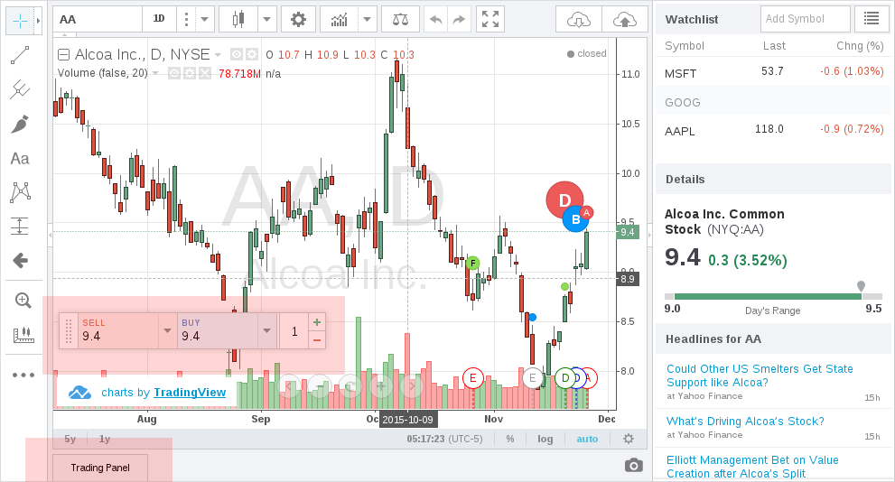
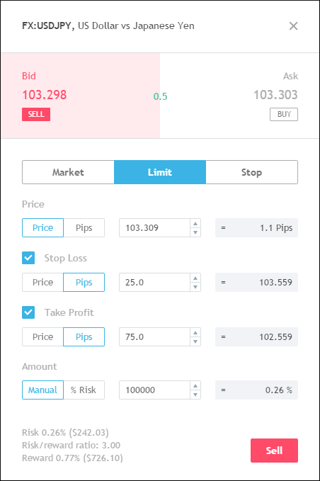
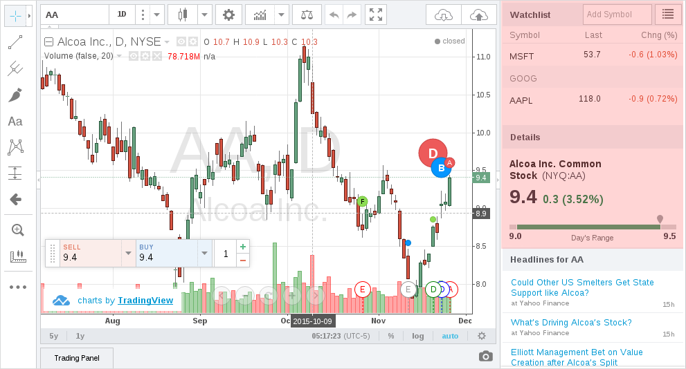
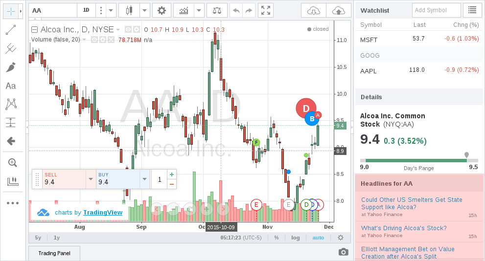
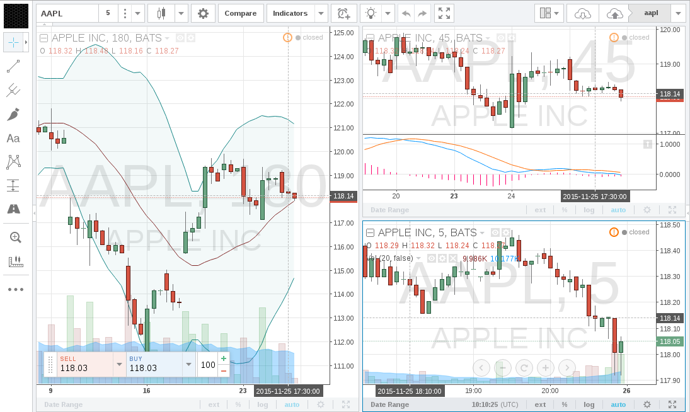

:chart: All content on this page applies to Trading Terminal only.

Trading Terminal is a ready-to-use product for those who want to have a great charting solution along with the ability to trade right from the chart.

This product is based on a Charting Library and includes all of its functionality, but also contains a bunch of additional features.

Trading Terminal repository is [here](https://github.com/tradingview/trading_platform).

## Trading Terminal Features

### Trading Capabilities

You can trade right from the chart, and all you have to do to make this work is to implement your [Broker API](Broker-API) and plug it into the chart widget.

### Advanced Order Dialog

Fully customizable order dialog allows to place Market/Limit/Stop/Stop Limit orders, enter Stop Loss and Take Profit prices,
choose expiration and calculate risks.

### Account Manager

You can display orders/positions and account information in an interactive table at the bottom.

**Read more about this feature:**

* [How to enable Account Manager](Account-Manager)

### DOM Widget

You can display orders/positions and Level 2 data in an interactive DOM widget.

### Sidebar Quotes (Symbol Details & Watchlist)

In the Trading Terminal, you can have the functionality of the Watchilsts and Details widget (see the snapshot below).

**Read more about this feature:**

* [How to enable sidebar quotes](Widget-Constructor#widgetbar)
* How to provide the data for quotes: depends on the type of data integration that you use - [JS API](JS-Api#trading-terminal-specific) or [UDF](UDF#quotes)

### Sidebar Market News Feed

You can have the news feed right in the sidebar of the chart. We are quite flexible in supporting various news feeds and you can have different feeds for different kinds of symbols as per the example below.

**Read more about this feature:**

* [Enabling sidebar news](Widget-Constructor#widgetbar)
* [Setting up different news feeds](Widget-Constructor#rss_news_feed)

### Multiple charts layout

You can have multiple charts inside of a single widget. This gives your user the ability to use a wide range of strategies, as well as the ability to have a broad view of the market. You don't have to do anythng to enable or tweak it: it works out-of-the-box.

### Japanese chart types: Kagi, Renko, Point & Figure, Line Break

These types of charts will be available out-of-the-box, just like Heikin-Ashi is available in the Charting Library.

<!-- markdownlint-disable no-trailing-punctuation -->

### Volume Profile :clock4:

This study will require some server-side support. We'll provide more details when it's ready.

### Drawing Tools Templates :clock4:

This functionality will require the support from your backend. We'll update our open-source data backend to support this feature also, so consider using it to minimize the efforts from your side.

<!-- markdownlint-enable no-trailing-punctuation -->

## How To Work With The Docs

Since Trading Terminal is based on the Charting Library, we decided to merge the documentation into a single Wiki.
All the docs are stored in one place.

Note that the specific features that are available in the Trading Terminal only are marked with this green sign :chart:.

## See Also

* [How to connect your trading back-end to the Trading Terminal](Broker-API)
* [Widget methods specific for Trading Terminal](Widget-Methods#chart-trading-terminal-specific)
* [Widget constructor parameters specific for Trading Terminal](Widget-Constructor#trading-terminal-only)
